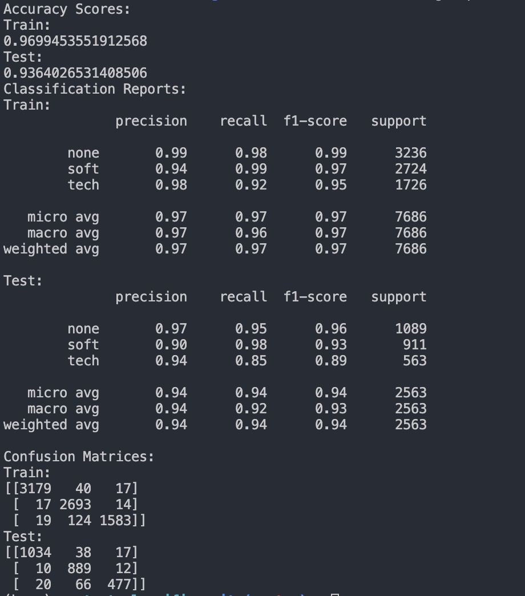

# Text-Classifier
Text Classifier for soft and technical skills (TalentBait Coding Test)

## Introduction
 The task was to train a model to be able to classify texts into technical skills, soft skills and texts that did not describe a skill.
 We will look at the following:
 - **Dataset**
 - **Feature Extraction**
 - **Model Training and Testing**
 - **Results**

## Dataset
The data set given was a json file containing strings with a text(in German) and a label that describes whether the text talks about soft skills, technical skills or it does not describe a skill.
I extracted the data from the file and split it into text and labels.
Also, in preparation for the training of the model, I split the dataset into training and test data (in a 3:1 ratio).

## Feature Extraction
I went with a vectorization approach to feature extraction from the text and used the TfidfVectorizor() function from the sci_kit learn library. I chose this function because it takes care of cleaning up the text and tokenization of each text before the vectorization.

## Model Training and Testing

### Training
I chose the Multinomial Naïve Bayes Classifier because it does not require great computational resources and an exceptionally large dataset to produce good results. 
After testing, I saved the model in the MNB_classifier file so it can be reused.

### Testing
I tested using the testing dataset created before. Since the train and test data was separated at the beginning, it is safe to say that the results of testing are a credible reflection of the performance of the model.

## Results
For metric evaluation I used accuracy scores, f-1 scores and confusion matrices to evaluate the performance of the model. The results can be seen in the image below:

## Analysis of Results

The accuracy scores show the percentage of correct predictions with respect to the total number of predictions. It can be seen that the model has very high accuracy.

The precision score for each class shows the percentage of true positives with respect to all positives, while the recall score shows the percentage of true positives with respect to the sum of true positives and false negatives. The F1 score is the harmonic mean between precision and recall and will show the robustness and precision of the model. The F1 score of this model indicates a very good performing model.

I added the confusion matrix to show the complete performance of the model. We can see that the values are much greater on the diagonal than anywhere else, indicating that most of the predictions were indeed accurate(as seen in the accuracy score).

## Starting Instructions
Simply run the `demo.py` script to view a demo of the model at work.
To run the tests on the model, simply uncomment the lines from 44 till the end and run the `model.py` script.
